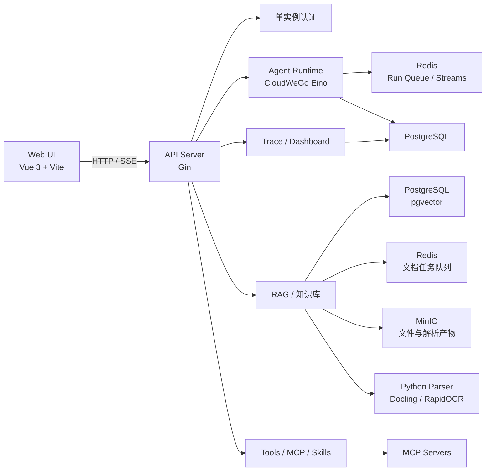

# Qavor

<p align="center">
  
</p>

<p align="center">
  <a href="https://go.dev/"></a>
  <a href="https://vuejs.org/"></a>
  <a href="https://vite.dev/"></a>
  <a href="https://www.postgresql.org/"></a>
  <a href="https://redis.io/"></a>
  <a href="https://github.com/6moran/Qavor"></a>
</p>

> 面向开发者的 AI Agent 构建、扩展、运行与观测平台。

Qavor 将模型接入、Agent 编排、知识库检索、工具扩展、异步执行和链路追踪整合在同一个全栈项目中。后端使用 Go、Gin 与 CloudWeGo Eino，前端使用 Vue 3 与 Vite，数据层由 PostgreSQL/pgvector、Redis 和 MinIO 组成。

<p align="center">
  <a href="#快速开始">快速开始</a> ·
  <a href="#系统架构">系统架构</a> ·
  <a href="#技术栈">技术栈</a> ·
  <a href="#文档索引">文档索引</a> ·
  <a href="#license">License</a>
</p>

<p align="center">
  <a href="https://github.com/6moran/Qavor">GitHub</a> ·
  <a href="docs/Restful%20API.openapi.json">OpenAPI</a> ·
  <a href="docs/model_integration_guide.md">模型接入指南</a>
</p>

## Qavor 是什么

Qavor 不是单纯的聊天界面，也不是通用后端脚手架。它提供了一套可实际运行的 Agent 开发环境：开发者可以配置模型与 Agent，接入 MCP Server 和 Skill，构建 RAG 知识库，通过流式对话运行 Agent，并在内置页面中查看执行状态、工具调用和完整 Trace。

项目当前采用单实例管理员认证，适合团队内部开发、Agent 原型验证和 AI 应用基础设施研究。

## 核心能力

| 能力 | 说明 |
| --- | --- |
| Agent 对话与管理 | 创建和配置 Agent，维护对话线程，支持流式输出、请求排队、取消、继续和运行中引导 |
| 模型管理 | 统一维护模型供应商、连接参数和模型能力，供 Agent 与知识库按 ID 绑定使用 |
| RAG 知识库 | 上传和解析文档，执行分块、向量化、检索与问答；向量数据存储在 pgvector |
| MCP 与内置工具 | 管理 MCP Server、刷新和启停工具，并通过统一工具注册表供 Agent 调用 |
| Skill 系统 | 从文件系统加载 Skill，支持依赖校验、动态激活、导入导出和运行时工具门控 |
| 工作区与附件 | 管理工作区文件、对话附件和 Agent 产物，并通过 MinIO 保存对象数据 |
| 异步执行 | 使用 Redis 队列和 Worker 处理 Agent Run、文档解析及文档入库任务 |
| SSE 流式服务 | 提供对话事件、心跳、任务状态和工具调用过程的实时传输 |
| 链路追踪 | 采集 Agent、LLM、Retriever 和 Tool 调用，提供 Trace 列表与详情视图 |
| 数据总览 | 汇总 Agent、知识库、工具调用和活跃情况，便于观察系统运行状态 |

## 系统架构



后端以 `internal/app/app.go` 作为统一装配入口，按 API → Service → Repository 的边界组织主要业务；Agent、RAG、队列、Skill、MCP 与 Trace 则各自保留独立运行模块。

## 技术栈

| 层次 | 技术 |
| --- | --- |
| 后端语言 | [Go 1.25.5](https://go.dev/) |
| HTTP 服务 | [Gin 1.12.0](https://github.com/gin-gonic/gin) |
| Agent 框架 | [CloudWeGo Eino](https://github.com/cloudwego/eino) |
| ORM | [GORM 1.31.2](https://gorm.io/) |
| 前端 | [Vue 3.5+](https://vuejs.org/)、[Vite 8](https://vite.dev/)、[Pinia 3](https://pinia.vuejs.org/) |
| UI 与可视化 | [Ant Design Vue](https://antdv.com/)、[ECharts](https://echarts.apache.org/)、[G6](https://g6.antv.antgroup.com/)、[Sigma.js](https://www.sigmajs.org/) |
| 主数据库 | [PostgreSQL](https://www.postgresql.org/) + [pgvector](https://github.com/pgvector/pgvector) |
| 队列与运行状态 | [Redis Streams](https://redis.io/docs/latest/develop/data-types/streams/) |
| 对象存储 | [MinIO](https://min.io/) |
| 文档解析（可选） | [Python](https://www.python.org/)、[Docling](https://github.com/docling-project/docling)、[RapidOCR](https://github.com/RapidAI/RapidOCR)、[PyMuPDF](https://pymupdf.readthedocs.io/) |
| 日志 | [Zap](https://github.com/uber-go/zap) + [Lumberjack](https://github.com/natefinch/lumberjack) |

## 快速开始

### 前置环境

| 依赖 | 要求 | 用途 |
| --- | --- | --- |
| Git | 可用版本 | 获取源码 |
| Go | 1.25.5 | 构建和运行后端 |
| Node.js | `^20.19.0` 或 `>=22.12.0` | 满足 Vite 8 的运行要求 |
| pnpm | 10.11.0 | 安装和运行前端依赖 |
| PostgreSQL | 已安装 pgvector 与 pg_trgm 扩展 | 后端必需，保存业务数据并提供向量与关键词检索 |
| Redis | 可连接实例 | 完整功能需要，承载 Run 与文档任务队列 |
| MinIO | 可连接实例及 Bucket | 完整功能需要，保存文件与解析产物 |
| Python | Python 3，可选 | 解析 Office、PDF 和图片文档 |

> PostgreSQL 是后端启动的必需依赖。Redis 或 MinIO 初始化失败时后端可以继续启动，但异步运行、文档处理或文件上传等功能会受限。

### 1. 获取代码

```bash
git clone git@github.com:6moran/Qavor.git
cd Qavor
```

### 2. 准备 PostgreSQL、pgvector 与 pg_trgm

先在 PostgreSQL 实例上安装 pgvector，并确认 PostgreSQL 自带的 `pg_trgm` 可用，然后创建数据库并启用两个扩展：

```bash
psql -U postgres -c "CREATE DATABASE qavor;"
psql -U postgres -d qavor -c "CREATE EXTENSION IF NOT EXISTS vector;"
psql -U postgres -d qavor -c "CREATE EXTENSION IF NOT EXISTS pg_trgm;"
```

如果 `qavor` 数据库已经存在，可以跳过第一条命令。全新数据库首次启动前，还需要在 `configs/config.yaml` 中临时设置：

```yaml
database:
  auto_migrate: true
```

后端首次成功启动并创建表后，建议将 `auto_migrate` 改回 `false`。升级已有数据库时，根据变更内容执行迁移脚本：

```bash
psql -U postgres -d qavor -f scripts/migrate.sql
```

> `scripts/migrate.sql` 面向已有表结构的增量迁移，不用于替代全新数据库的首次建表。

### 3. 创建本地配置

应用启动时需要同时存在 `configs/config.yaml` 和根目录 `.env`。

PowerShell：

```powershell
Copy-Item configs/config.yaml.example configs/config.yaml
Copy-Item .env.example .env
```

Bash：

```bash
cp configs/config.yaml.example configs/config.yaml
cp .env.example .env
```

至少检查并修改以下配置：

- `POSTGRES_*`：PostgreSQL 地址、账号、密码和数据库名。
- `REDIS_*`：Redis 地址、数据库编号和密码。
- `MINIO_*`：MinIO 地址、Access Key、Secret Key、Bucket 和公开访问地址。
- `QAVOR_AUTH_ADMIN_USERNAME`、`QAVOR_AUTH_ADMIN_PASSWORD`：登录 Qavor 的管理员账号。
- `JWT_SECRET`：JWT 签名密钥，生产或共享环境必须使用强随机值。

配置样例中的服务地址仅作示例。使用本地环境时，请把 `configs/config.yaml` 和 `.env` 中的数据库、Redis、MinIO 地址统一改为你的本地或独立测试实例。

### 4. 安装依赖

安装后端依赖：

```bash
go mod download
```

安装前端依赖：

```bash
cd frontend
pnpm install
cd ..
```

如果需要解析 `.docx`、`.pptx`、`.xlsx`、PDF 或图片，再安装 Python 依赖：

```bash
python -m pip install -r pkg/documentparser/python/requirements.txt
```

该依赖集合包含 Docling 和 OCR 组件，首次安装及模型下载耗时较长。不使用上述文档解析能力时可以跳过。

### 5. 启动后端

在仓库根目录运行：

```bash
go run ./cmd/server
```

默认监听地址为 `http://localhost:8080`。启动失败时优先检查：

1. `configs/config.yaml` 和 `.env` 是否存在。
2. PostgreSQL 是否可连接，`qavor` 数据库是否已创建。
3. pgvector 与 pg_trgm 是否已在 `qavor` 数据库中启用。
4. 管理员账号和 JWT 密钥是否已配置。

### 6. 启动前端

新开一个终端：

```bash
cd frontend
pnpm dev
```

前端默认地址为 `http://localhost:5173`。开发服务器会把 `/api` 请求代理到 `http://127.0.0.1:8080`；如需修改后端地址，可在前端环境文件中设置：

```dotenv
VITE_API_PROXY_TARGET=http://127.0.0.1:8080
```

### 7. 验证服务

PowerShell：

```powershell
Invoke-RestMethod http://localhost:8080/api/v1/health
```

Bash：

```bash
curl http://localhost:8080/api/v1/health
```

健康检查成功后，访问 `http://localhost:5173`，使用 `.env` 中配置的 `QAVOR_AUTH_ADMIN_USERNAME` 和 `QAVOR_AUTH_ADMIN_PASSWORD` 登录。

登录后的推荐配置顺序：

1. 在“智能体”管理页配置模型供应商和模型。
2. 创建 Agent，并选择需要使用的模型、工具、MCP Server 和 Skill。
3. 如需 RAG，创建知识库并分别绑定 Embedding 模型与 Chat 模型。
4. 上传文档，等待解析后手动或批量执行向量入库。
5. 在 Agent 对话页发起请求，并在“链路追踪”页查看执行过程。

## 配置说明

Qavor 先读取 `configs/config.yaml`，再通过进程环境变量和根目录 `.env` 覆盖数据库、认证、JWT、RAG 等敏感或环境相关配置。不要提交真实的 `.env` 和 `configs/config.yaml`，这两个文件已在 `.gitignore` 中排除。

| 配置域 | 关键配置 | 说明 |
| --- | --- | --- |
| 应用 | `APP_MODE`、`APP_PORT` | 运行模式与 HTTP 端口 |
| 认证 | `QAVOR_AUTH_ADMIN_USERNAME`、`QAVOR_AUTH_ADMIN_PASSWORD`、`JWT_SECRET` | 单实例管理员登录与 Token 签名 |
| PostgreSQL | `POSTGRES_HOST`、`POSTGRES_PORT`、`POSTGRES_USERNAME`、`POSTGRES_PASSWORD`、`POSTGRES_DATABASE` | 必需；保存业务数据、Trace 和向量 |
| Redis | `REDIS_HOST`、`REDIS_PORT`、`REDIS_DB`、`REDIS_PASSWORD` | Run 队列、文档队列和运行状态 |
| MinIO | `MINIO_ENDPOINT`、`MINIO_ACCESS_KEY`、`MINIO_SECRET_KEY`、`MINIO_BUCKET`、`MINIO_PUBLIC_ENDPOINT` | 文件、附件与解析产物 |
| RAG | `RAG_CHUNK_TOKENS`、`RAG_CHUNK_OVERLAP_TOKENS`、`RAG_TOP_K` | 分块、召回数量和请求超时等算法默认值 |
| Trace | `trace.enabled`、`trace.retention_days`、`trace.timeout_minutes` | 链路采集、保留周期和超时判定 |
| Skill | `app.skills_dir` | Skill 文件目录；留空时使用工作目录下的 `qavor/skills` |

模型 API Key 不写入全局 README 配置。模型连接信息通过系统的模型管理功能保存，并由 Agent 或知识库按模型 ID 选择。

## 项目结构

```text
Qavor/
├── cmd/server/                  # 后端程序入口
├── configs/                    # YAML 配置样例与本地配置
├── internal/
│   ├── agent/                  # Agent 执行与工具编排
│   ├── api/                    # Gin 路由与 Controller
│   ├── app/                    # 应用初始化、依赖装配与关闭流程
│   ├── ingestion/              # 文档解析入口
│   ├── mcp/                    # MCP 客户端与连接管理
│   ├── rag/                    # 分块、索引、检索与回答图
│   ├── repository/             # PostgreSQL 数据访问
│   ├── run/                    # Agent Run 队列与 Worker
│   ├── service/                # 核心业务服务
│   ├── skill/                  # Skill 加载、依赖与运行路由
│   ├── trace/                  # Agent 链路采集与清理
│   └── worker/                 # 文档异步处理 Worker
├── pkg/                        # 配置、数据库、日志、MinIO、解析器等公共包
├── frontend/                   # Vue 3 + Vite Web 应用
├── qavor/                      # Qavor 运行资源与 MCP 配置
├── scripts/                    # 数据库迁移和辅助脚本
├── testdata/                   # API 与模型联调示例
├── docs/                       # 架构、API 与专项设计文档
├── go.mod
├── Makefile
└── README.md
```

## 常用命令

后端：

```bash
go run ./cmd/server                 # 启动后端
go test ./...                       # 运行 Go 测试
go build -o bin/qavor-api ./cmd/server  # 构建后端
go fmt ./...                        # 格式化 Go 代码
go vet ./...                        # 静态检查
```

前端（在 `frontend/` 目录执行）：

```bash
pnpm dev          # 启动开发服务器
pnpm test:unit    # 运行单元测试
pnpm build        # 构建生产资源
pnpm lint         # ESLint 检查并自动修复
```

项目也提供 Makefile：

```bash
make run
make test
make build
make fmt
make vet
```

> Makefile 命令依赖类 Unix 工具。在 Windows PowerShell 中，优先直接使用对应的 `go` 与 `pnpm.cmd` 命令。

## 文档索引

- [OpenAPI 定义](docs/Restful%20API.openapi.json)
- [项目设计文档](docs/设计文档.md)
- [数据库设计](docs/数据库设计.md)
- [用户认证模块](docs/用户认证模块.md)
- [模型接入指南](docs/model_integration_guide.md)
- [Agent 对话链路追踪设计](docs/Agent对话链路追踪设计文档.md)
- [模型供应商测试说明](testdata/README.md)

README 只维护项目入口、依赖边界和本地启动流程；完整接口字段和专项模块设计以对应文档及当前代码为准。

## 开发注意事项

1. **不要共用开发队列。** 多台开发机或多个本地实例如果连接同一个 Redis，并使用同一个 `document_queue.parse_group`，Redis 会把文档任务分发给消费组中的任意实例。请为独立环境配置不同 Redis 数据库、Stream 或消费组。
2. **先启用 pgvector，再首次建表。** `knowledge_chunks.embedding` 使用 `vector` 类型，扩展未启用时自动迁移会失败。
3. **首次迁移后关闭自动迁移。** 新环境可临时开启 `database.auto_migrate`，表结构建立后改回 `false`，后续升级使用明确的迁移脚本。
4. **区分可启动与功能完整。** Redis、MinIO 初始化失败不会阻止 HTTP 服务启动，但相关队列、文件和知识库流程不可用。
5. **Python 是按功能选装。** 文本和 Markdown 可走 Go 侧解析；Office、PDF 和图片解析依赖 `pkg/documentparser/python/requirements.txt`。
6. **知识库按 ID 绑定模型。** RAG 使用知识库绑定的 Embedding 与 Chat 模型，不依赖一个全局默认模型配置。
7. **优先运行窄范围验证。** 修改后先测试相关 Go 包或前端单测，再根据改动范围运行 `go test ./...` 与前端完整构建。

## License

当前仓库未包含 `LICENSE` 文件，暂未声明具体开源许可证。除非项目维护者另行授权，请不要将代码重新发布或用于商业分发。
